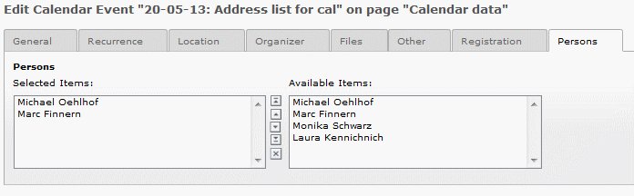

.. addresslist4cal documentation master file, created by
   sphinx-quickstart on Thu May 09 20:45:55 2013.
   You can adapt this file completely to your liking, but it should at least
   contain the root `toctree` directive.

.. role::   typoscript(code)
.. role::   ts(typoscript)
   :class:  typoscript
.. role::   php(code)
.. highlight:: guess
.. toctree::
   :maxdepth: 3

Welcome to addresslist4cal's documentation!
===========================================

============================================================
EXT: Addresslist4Cal
============================================================

:Extension Key: addresslist4cal
:Language:      en
:Keywords:      cal, tt_address
:Author:        Michael Oehlhof <typo3@oehlhof.de>
:Date:          2013-05-09
:Description:   Using address data in cal events

=============
 Introduction
=============

-----------------
 What does it do?
-----------------
This extension adds usage of tt_address records for cal events.
Maybe your cal events are sessions which have one ore more speaker.
For this case you can add the speaker (tt_address record) to the cal event 
with the use of this extension.

**Best practise from the scratch**

- Easy to use/understand for editors

**Background**

- Following the TYPO3 coding guidelines

- Documentation based on reST

---------------------------------------
 Before updating to the latest version
---------------------------------------
Before updating any version of the extension to the latest one, always
check out the `release notes`_ in the wiki:

.. _release notes: http://forge.typo3.org/projects/extension-addresslist4cal/wiki/Release\_Notes

-------------
 Screenshots
-------------

**Image 1:** Show settings in the cal event.

=============
 User manual
=============

In the BE you only have to select the tt_address records which should
be displayed within the cal event display.

The needed changes for the cal event template are described in the 
:ref:`my-templating-label` section.

If you want to add a link to a detail page, using wt_directory for example, you can add TypoScript configuration
to add creation of the target url of the detail page.

================
 Administration
================

This chapter describes how to manage the extension from a superuser point of view.

--------------------------
 Installing the extension
--------------------------

The extension is installed like any other extension via the TYPO3 extension repository.
When installing a new field *tx_addresslist4cal_addresses* is added to the *tx_cal_event* table.

--------------------------
 TypoScript configuration
--------------------------

^^^^^^^^^^^^
 detailPage
^^^^^^^^^^^^

The TypoScript setting *detailPage* defines the page id of the page with the detail view of an address record.

::

	plugin.tx_addresslist4cal.detailPage = 81

^^^^^^^^^^^^^^^^^
 addressUidParam
^^^^^^^^^^^^^^^^^

The TypoScript setting *addressUidParam* defines the url parameter that passes the uid of the tt_address record
to the detail page.

::

	plugin.tx_addresslist4cal.addressUidParam = tx_wtdirectory_pi1[show]

.. _my-templating-label:

------------
 Templating
------------

The templating is done by enhancing the existing cal event template.

In the *event_model.tmpl* file the section **TEMPLATE_PHPICALENDAR_EVENT** has to be enhaced.

The template for displaying every single address record must created inside of the section
**TEMPLATE_PHPICALENDAR_EVENT**.
The marker for the single address template is **ADDRESSLIST4CAL_ADDRESS**. A sample template part looks like this:

::

	<!-- ###ADDRESSLIST4CAL_ADDRESS### begin -->
	###LAST_NAME###, ###FIRST_NAME### 
	

	<!-- ###ADDRESSLIST4CAL_ADDRESS### end -->

For each *tt_address* record this template is used and concatenated to the previous one.
Inside the template you can use all field names of the *tt_address* record (in upper case) as marker.

The complete address list is then inserted inside the **TEMPLATE_PHPICALENDAR_EVENT** section
with the marker **ADDRESSLIST4CAL** .

Using the TypoScript settings for the detail page, the template part looks like this:

::

	<!-- ###ADDRESSLIST4CAL_ADDRESS### begin -->
	###LAST_NAME###, ###FIRST_NAME### 
	<a href="###DETAIL_PAGE_URL###">Details...</a> 
	

	<!-- ###ADDRESSLIST4CAL_ADDRESS### end -->

===============
 Configuration
===============

This chapter describes the settings which are available in addresslist4cal.

---------------------------
 plugin.tx_addresslist4cal
---------------------------

^^^^^^^^^^^
 Reference
^^^^^^^^^^^

Except of overriding labels of the locallang-file, the settings are defined by using
:typoscript:`plugin.tx\_addresslist4cal.settings.<property>`.

A simple way to get to know the default settings is to look at the
file :php:`EXT:addresslist4cal/Configuration/TypoScript/setup.txt`

^^^^^^^^^^^^^^^^^^^^
 Reference TsConfig
^^^^^^^^^^^^^^^^^^^^

This section covers all configuration which can be set with TsConfig.
Every configuration starts with :typoscript:`tx\_addresslist4cal`.

==========
 Tutorial
==========

This tutorial is best suited for day-to-day webmasters or editors having to integrate the address list for cal.

There is no tutorial this time. It will be added later.

==================
 Developer manual
==================

This chapter is really targeted at extension developers.

================
 Known problems
================

addresslist4cal should work with all supported TYPO3 versions.

The `bug tracker`_ holds all known bugs. If you think you have found a bug, 
please report (if not already done) at forge and attach at least those information
to make it as easy as possible to resolve it:

- Understandable title & description: Please use English and include how
  the bug can be reproduced

- TYPO3 & addresslist4cal version

- Of course an attached patch is awesome but not a must.

============
 To-Do list
============

Please use the extension's `bug tracker`_ on Forge to propose new features.

.. _bug tracker: http://forge.typo3.org/projects/extension-addresslist4cal/issues

===========
 ChangeLog
===========

An automatic Changelog and `roadmap`_ is generated by forge. Please
follow this link to know which bugs have been fixed in which version.

.. _roadmap: http://forge.typo3.org/projects/extension-addresslist4cal/roadmap

======
 Wiki
======

Further help can be found in the `wiki of the project`_.

.. _wiki of the project: http://forge.typo3.org/projects/extension-addresslist4cal/wiki

There will be snippets, examples, tutorials.

If you want to share something (remember: TYPO3 inspiring people to
share), please add it to the issue tracker or send it per mail to me.

------------------------
 Sponsoring & Bugfixing
------------------------

Nobody is perfect and nothing is complete. Out of those 2 simple
reason there is still a chance that some bugs made it into your
version of addresslist4cal. If you found a bug, please check the `issues page`_
if the bug has already been reported (and maybe even already been fixed) and if
this is not the case please report it there!

.. _issues page: http://forge.typo3.org/projects/extension-addresslist4cal/issues

Everyone of the team got already a regular job, wife and plenty of
hobbies. Please understand that there are weeks and months with not
that much free time for TYPO3 and this extension. Chances of bugfixes
and implementation of features rises with sponsoring!

Help, especially including patches, is of course always welcome!

------------------------
 Donate
------------------------

Donations are one way to show a developer your thankfulness!
Many hours are being put into this extension to make it possible 
for you to build awesome sites in no time!
Have a look at the `git logs`_  to get a proof.

.. _git logs: http://git.typo3.org/TYPO3v4/Extensions/addresslist4cal.git?a=shortlog

If this extension is part of your offers, it would be awesome to pass 
a tiny little bit of it back to the original developers!

^^^^^^^^^^^^^^^
 How to donate
^^^^^^^^^^^^^^^

Take a look at the `authors webpage`_

.. _authors webpage: http://www.oehlhof.de/T3/typo3-cms.html

------------------------
 Say thanks
------------------------

The extension has been developed in paid free time which
could have been spent in so many other ways too. If you like this
extension, it would be awesome if you could do one (or all) of the
following proposals:

- **Say thanks** to the developer. You can use emails or make it public at
  the genreral TYPO3 mailinglists. Mostly you can meet the developer in person
  on TYPO3 events like the TYPO3camp RheinRuhr or the meetings of the TYPO3
  user group RheinRuhr in the *Ruhrgebiet* (Germany).
- **Spread the word!** If you like this extension, tell your friends,
  colleagues,... about it.
- **Donate!** If you use this extension in your paid projects and you and your
  clients are happy with it, think about donating a small amount.
  Get in contact with me for details.

------------------------
 Big thanks to
------------------------

Thanks to the following person as this extension wouldn't be there without you:

- Marc Finnern `www.klickfabrik.net`_.

.. _www.klickfabrik.net: http://www.klickfabrik.net/

